<!-- TODO create a table of contents -->

All the network request is wrapped by [RequestStateWrapper](/src/pages/components/containers/RequestStateWrapper.tsx) to handle the loading, error/success message display.
Forms are wrapped by [FormContainer](/src/pages/components/containers/FormContainer.tsx) to contain a similar styling and Individual Input fields are wrapped by [InputFeedBackContainer](/src/pages/components/containers/InputFeedBackContainer.tsx) to display error message feedbacks.

### user registration

#### Light theme

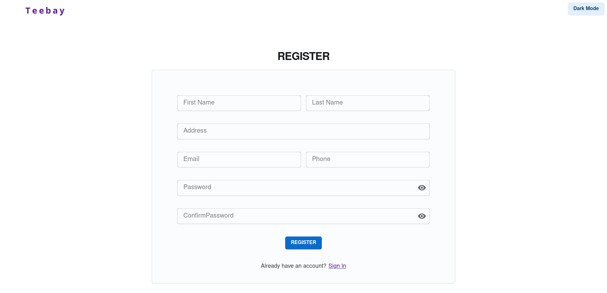

#### Dark theme

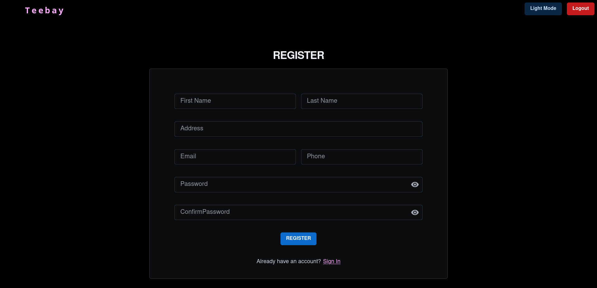

Registration process leads user to the login page (the application is not currently auto logging in users after registration for security reasons, but this could be a interesting idea to explore).

### login

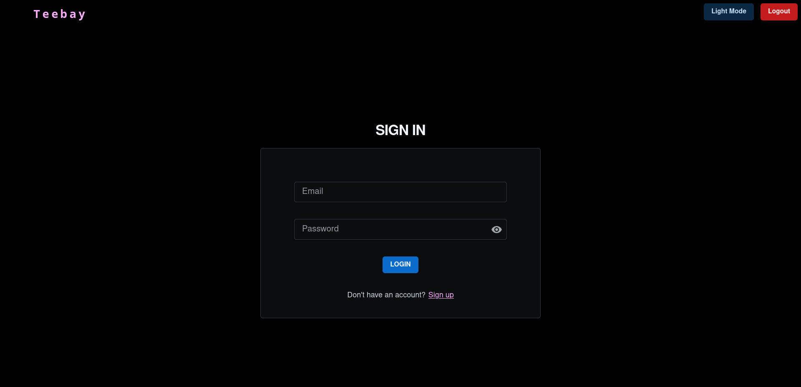

Successful login redirects user to the home page, and updates the top bar with a logout button. Logging out redirects user back to homepage.

### Homepage

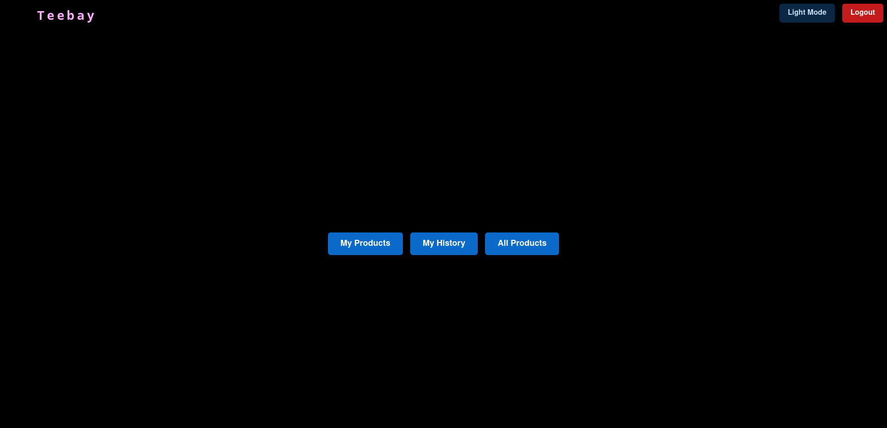
Which Contains three options, **History** , **Products by logged in user** and **all products** by all logged in user.

#### My Products(Path 1)

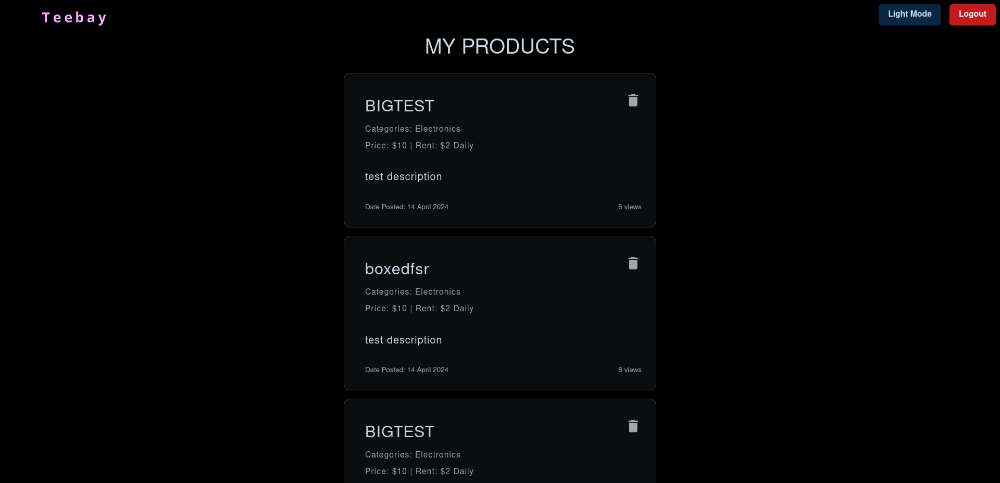

This lists all the products by user who is logged in. Clicking into any products leads to Update page for the product.

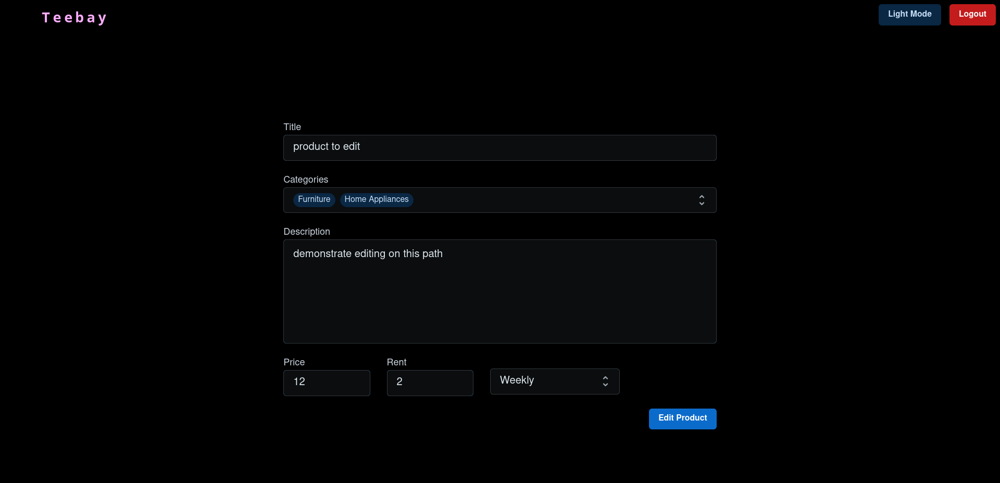

Successful edit redirects user back to My products page.

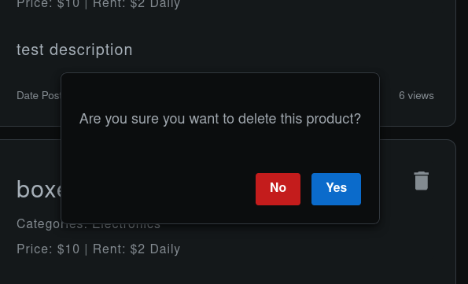

Clicking on the delete button pops to confirmation modal for deletion (action taken based on modal click)

#### All Products(Path 2)

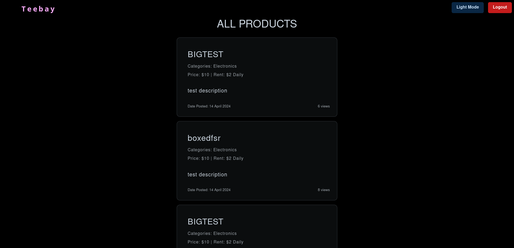

This uses same component/wrapper to view products at My products Page, but leavs out the delete button. Also Clicking on link leads user to product view page.

##### 2.1

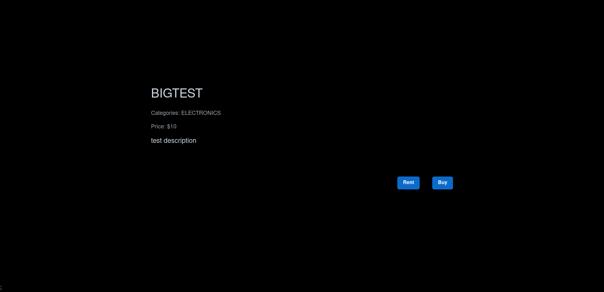

with options to buy/rent if it is available.

##### 2.1.1 - Renting

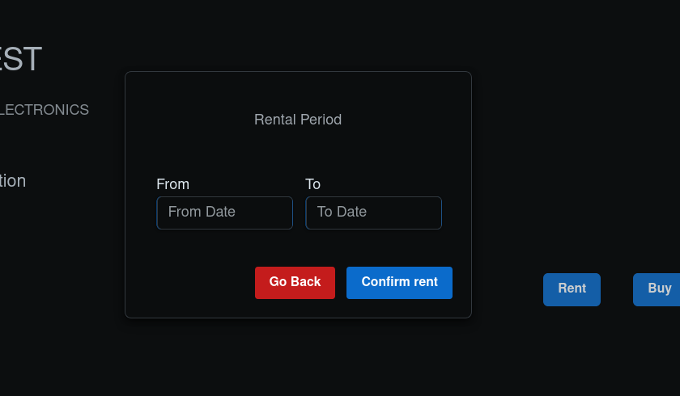

Clicking on rent shows user two input fields, which expands to a date picker if User click on any one of them, the date picker expands. User can select range of dates which reflects in UI.

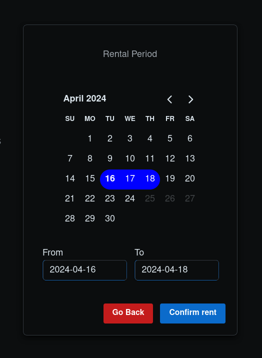

The dates unavailable dates are marked as disabled, but user could select overlapping range(start date before disabled range and end date after disabled range), which will send a error message from backend (currently frontend does not invalidate it yet)

##### 2.1.2 - Buying

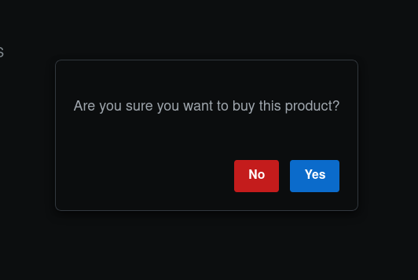

Clicking on buy gets this modal, currently no payment system is in place- so clicking on confirm just buys the logged in user the product.

##### 2.2

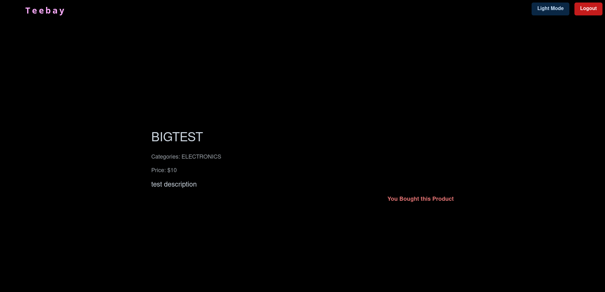

If product is not available for buying, it is shown as unavailable

There are four such messages in total "You Bought this Product". "You Sold this product", "You own this product" (current user is original) and "Product Sold" (current user was not involved in selling process).

#### History(Path 3)

History page has four tabs, "Bought", "Sold" ([Selling Type](#31---selling-type)), "Borrowed" and "Lent" ([Rent Type](#31---rent-type))
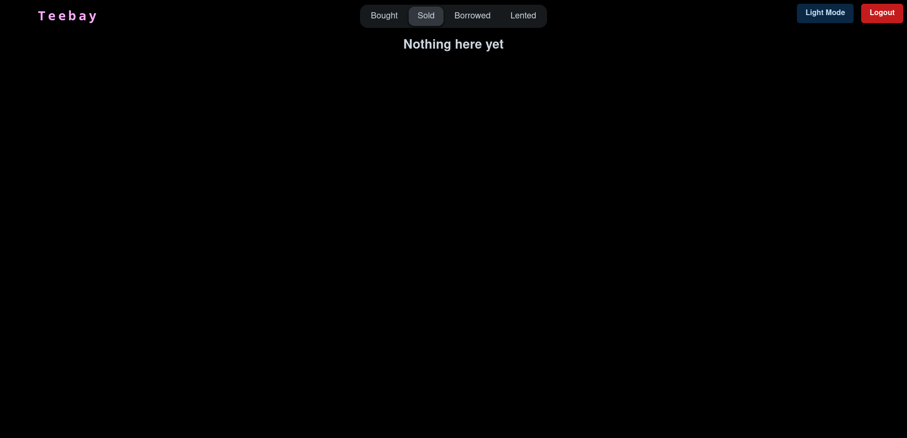

If user has no transactions(on the particular tab), empty tab is shown with message.

##### 3.1 - Rent type

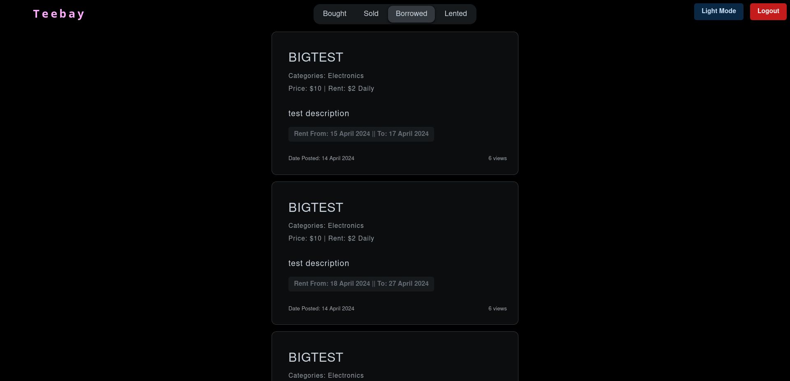

This presents with a card (same as [My](#my-productspath-1)/[All](#all-productspath-2) product), which is unclickable- and presents us with rent duration data (under product description). If product has multiple Rent history, they are put in separate cards.

##### 3.1 - Selling type

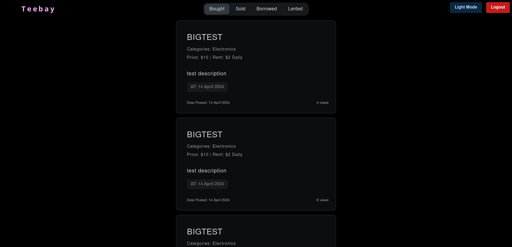

And selling type has the Date of transaction under product description
